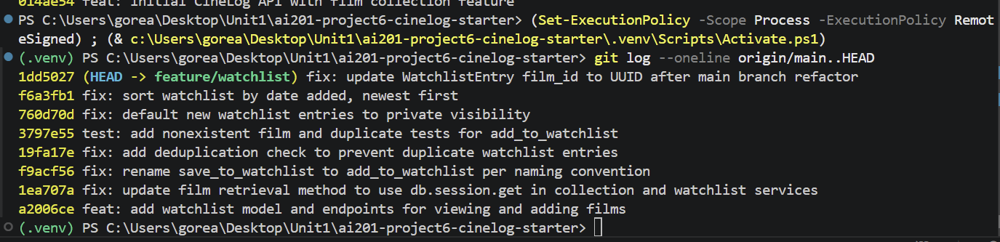

# PR Response Doc — CineLog Watchlist Feature

## AI Usage
I used Claude Code as a guide during this project:
- **Orientation:** it summarized `models.py`, `services/collection_service.py`, and the test patterns in `tests/test_collection.py` before I read the review comments, and gathered all six comments in one place so I could plan the order to address them.
- **Understanding the patterns:** before each change I had it explain the existing convention I needed to follow — how `add_to_collection()` handles deduplication, how the collection route maps service exceptions to status codes, and how the existing test fixtures are structured.
- **Design decisions (Comments 4 and 5) were my own.** I chose private-by-default visibility and agreed with the maintainer on date-added sorting; I used the AI to lay out the tradeoffs of each option and to stress-test my position before writing it up.
- **Rebase and hygiene:** it helped me diagnose why the first rebase attempt failed (`main`'s refactor had *deleted* `WatchlistEntry`, not just changed its types), verify conventional commit format, and confirm each change with project-wide searches and the full test suite. It also assisted in applying the changes I decided on.

## Comment 1 — Rename
**What I did:** Renamed `save_to_watchlist()` to `add_to_watchlist()` in `services/watchlist_service.py` and updated both references in `routes/watchlist/watchlist.py` (the import on line 8 and the call inside the `POST /watchlist/<user_id>/add` handler). The new name matches the `verb_to_noun` convention set by `add_to_collection()` in the collection service.
**How I verified:** Ran a project-wide search for `save_to_watchlist` after the change — zero matches, so no call sites were missed. Full test suite passes.

## Comment 2 — Deduplication
**What I did:** Followed the exact pattern from `add_to_collection()`: query `WatchlistEntry` by `(user_id, film_id)` and, if an entry already exists, raise a new dedicated exception `AlreadyInWatchlistError` instead of inserting a duplicate. I also updated the route to catch it and return **409 Conflict** (and `FilmNotFoundError` → 404), mirroring how `routes/collection.py` maps service exceptions to status codes — before this, a duplicate would have produced an unhandled 500.
**How I verified:** Wrote `test_add_to_watchlist_duplicate_raises`, which adds the same film twice, asserts the exception is raised, and asserts exactly one row exists afterward. It fails on the pre-fix code and passes after.

## Comment 3 — Missing test
**What I did:** Created `tests/test_watchlist.py` with `test_add_to_watchlist_nonexistent_film_raises`, modeled directly on `test_add_to_collection_nonexistent_film_raises` in `tests/test_collection.py` — same `app` / `sample_user` fixtures (in-memory SQLite, isolated per test), same structure of passing a fake UUID and asserting `FilmNotFoundError` with `pytest.raises`.
**How I verified:** `pytest tests/test_watchlist.py -v` — both watchlist tests pass; full suite (6 tests) passes.

## Comment 4 — Default visibility
**My position:** Watchlists should default to **private** (`public=False`). I changed the model default according to this.
**Reasoning:** A watchlist is a record of *intent*, not activity, it can reveal personal interests a user never chose to broadcast things like genres, themes, subject matter they're curious about but haven't watched or rated. Different to the collection, where logging a film is an active, and purposeful act of cataloging, adding to a watchlist is more a "save for later" gesture, so users tap it quickly and rarely think about who can see it. Defaulting that to public means the platform publishes information users didn't consciously decide to share. Making sharing opt-in means every public watchlist on CineLog is one the user actually chose to expose, which also makes the social signal more meaningful, not less meaningful.
**Tradeoff acknowledged:** I understand that making watchlists private by default can reduce discovery. CineLog is a community film tracking application, and many users may never change the default setting. This means there could be fewer public watchlists for other users to explore.

I still think this is the better tradeoff. The application can encourage users to make their watchlists public with a message such as "Make this list public?" However, it is much harder to recover a user's trust if information they expected to be private was shared automatically. The reviewer's main point was that the default should be an intentional decision, and I believe private by default is the safer and more respectful choice.

## Comment 5 — Sort order
**My position:** I agree with the maintainer — I changed `get_watchlist()` to sort by `date_added` descending (newest first).
**Reasoning:** The main reason is how I think people will actually use a watchlist. A common question is probably "What did I just save?" Showing the newest items first makes that information easy to find. With alphabetical sorting, a film that was just added could appear anywhere in the list.

It also makes the behavior more consistent with get_collection(), which already sorts using date_added.desc(). Now both list endpoints behave in the same way, which is more predictable for API users and also makes it easier for the frontend to handle both lists consistently.
**Engagement with reviewer's point:** understand the argument for alphabetical sorting because it can make it easier to find a specific title. However, I think sorting by date added is more useful as the default behavior. For watchlists with a normal number of films, users can still scan the list, and if finding a specific title becomes difficult, search and filtering would be a better solution.

In the future, an optional ?sort=title query parameter could give users both options while keeping the default focused on recently added films.

This change also allowed me to simplify the query because the join(Film) was only necessary when sorting by title, so I removed it.

## Comment 6 — Rebase
**What conflicted:** The refactor on `main` ("refactor: migrate film IDs from integer to UUID") didn't just change `Film.id` from `Integer` to `String(36)` — it also **removed the `WatchlistEntry` model entirely**, because the watchlist feature only existed on this branch. When I first ran `git rebase origin/main`, the early commits replayed silently (none of them re-added the model), and the rebase blew up later at the visibility commit, which tried to modify a class that no longer existed in `models.py`.
**How I resolved it:** I aborted the first attempt and redid the rebase with `git rebase -i origin/main`, marking the original watchlist commit as `edit`. At that stop I resolved by intent: kept `main`'s post-refactor `models.py` (UUID `Film.id`, UUID `CollectionEntry.film_id`) **and** re-added `WatchlistEntry` — in its original form at that point in history, so each later commit still applied as one clean logical change. I also reworded that commit's message ("added watchlist model and endpoint fixed a bug more changes" → `feat: add watchlist model and endpoints for viewing and adding films`) while stopped there. After the rebase finished, I made a dedicated commit migrating `WatchlistEntry.film_id` from `Integer` to `String(36)` and updating the stale integer references in the service and route docstrings: `fix: update WatchlistEntry film_id to UUID after main branch refactor`.
**How I verified no conflict remains:** `git status` clean and `git rebase` reported success; `git log --merges origin/main..HEAD` is empty (no merge commits, linear history on top of `main`); a project-wide search for `db.Integer` shows no remaining film-ID usages; full test suite (6 tests) passes against the UUID schema — the nonexistent-film test passes a UUID string, exercising the new key type end to end.

<!-- SCREENSHOT: run `git log --oneline` in the repo, screenshot it, save as git-log.png in the repo root, and it will render below -->

## PR Description
**What the feature does:** Adds a watchlist to CineLog — films a user wants to watch later, as opposed to the collection (films already watched and logged). It introduces the `WatchlistEntry` model (UUID film IDs, per the current schema) and two endpoints:
- `GET /watchlist/<user_id>` — returns the user's watchlist, sorted by date added (newest first), with each film's details plus `date_added` and `public` visibility.
- `POST /watchlist/<user_id>/add` with body `{ "film_id": "<uuid>" }` — adds a film. Returns **201** with the entry, **400** if `film_id` is missing, **404** if the film doesn't exist, **409** if it's already on the watchlist.

**Design decisions:**
1. **Visibility defaults to private (`public=False`).** A watchlist reveals intent and personal interests; sharing should be an explicit opt-in choice, not an inherited default. Tradeoff (reduced social discovery) acknowledged and accepted — see Comment 4 above.
2. **Sort order is date-added, newest first** — matching the maintainer's preference and `get_collection()`'s existing behavior, so both list endpoints are consistent. See Comment 5 above.

**How to test manually:**
1. `python -m venv .venv` and activate it, `pip install -r requirements.txt`, then `python app.py` (serves on `http://127.0.0.1:5000`; there is no frontend — use curl).
2. Create a user and film in a Flask shell, or grab existing IDs from the API/db. Then:
3. `curl -X POST http://127.0.0.1:5000/watchlist/<user_id>/add -H "Content-Type: application/json" -d "{\"film_id\": \"<film_uuid>\"}"` → expect **201** and the new entry with `"public": false`.
4. Repeat the same request → expect **409** with an "already on this user's watchlist" error.
5. Send a made-up UUID as `film_id` → expect **404**.
6. Add a second film, then `curl http://127.0.0.1:5000/watchlist/<user_id>` → expect the most recently added film **first**.
7. `pytest tests/ -v` → 6 tests pass.
